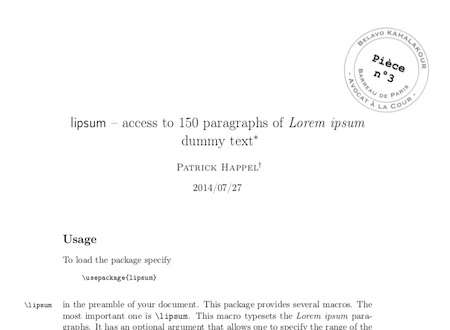

# PieceStamp

A very messy and crude Applescript utility using some python (and obsoleted ObjC CG methods) and ImageMagick, to generate watermarks on documents for legal case:

What it does
-

This script will ingest:

- a PDF holding ALL the documents as one file
- a text file listing all elements included in PDF (with a given agreed readable format)
- a PNG file holding a seal / stamp -like file (transparent background) with enough blank space in the middle to print the numbering

It will then proceed to: 

- use the text file to identify the different documents
- *split the PDF in its individual parts*
- apply the watermark (adding numbering of each attachment in the watermark for each pages)
- *merge back the pdf as one final file*
- *remove the temp files*
- show you the final file as a new file.

You may then copy that file back to the case folder.

How to use
-
### Pre-requisites
[ImageMagick](https://imagemagick.org) must be installed. If missing the script will alert you and stop.
You may nstall it by opening the terminal and using [Homebrew](https://brew.sh) with `$> brew install imagemagick`

You may want to create your stamp file using the Illustrator templates in `/resources/`. But you need Illustrator. Otherwise, you can use [Inkscape](https://inkscape.org) but you have to redo the curved texts.

### Elements
You need to have a folder holding:

- your documents merged as one single PDF file (called `Pièces.pdf`)
- a text file listing the various documents (see `/Dossier TEST/Bordereau.txt` for an exemple), which may also include informations about the case. Each attachment is listed as one line as: `Pièce NUMBERINGOFELEMENT : TITLE OF THE ATTACHEMENT [NUMBEROFPAGES]`
- a stamp PNG (`tampon.png`) (this should be copied from where you hold it). It may be 500x500, the script will resize it and pivot it a bit sideways.

Beware : The total number of pages for all listed documents as summed inside `bordereau.txt` must be consistent with the number of pages of the PDF file.
### Run it
You will then just run the AppleScript `PiecesTracker.scpt`(could be saved as a standalone app too), point it to the folder holding your documents, and it will do its magic.

ToDo
-
- Verify max size of the page to avoid watermark printing outside page itself! *(A4 works but on some machines it gets printed too far outside the page. Some issues with the retina display? No clue)*
- Insert ToC into the PDF as well to allow for compliance with current expectations

Optimisation 
-
- use another PDF lib (ObjC CG is expected to be obsoleted)
- allow png to be added once only inside the pdf
- generate numbering manually

# Credits
Python code is lifted from old implementation of Mac OS X Automator "Watermark PDF Documents", which used a snippet of python. Example of that code can be retrieved here [https://github.com/tlk/macosx-automator-watermark-pdf](). (current Mac OS Mojave implementation has been turned into an executable, code is now unavailable)